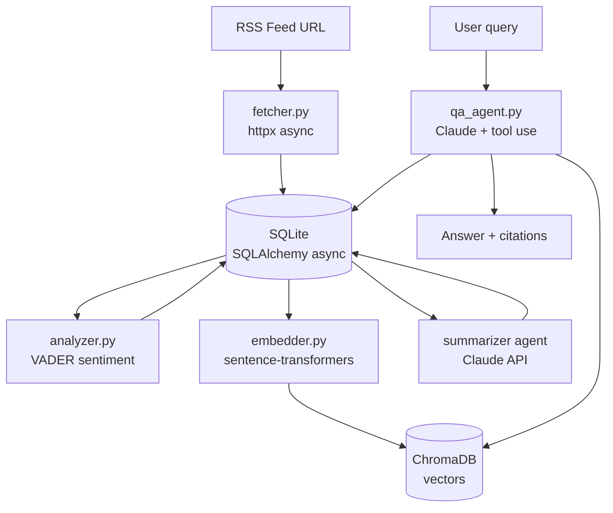

# Architecture

feedwatch is a layered async Python application. Each layer has a single responsibility.

---

## Project structure

```
feedwatch/
├── feedwatch/
│   ├── config.py          # pydantic-settings — reads .env
│   ├── models/
│   │   ├── feed.py        # Feed SQLAlchemy model
│   │   └── article.py     # Article SQLAlchemy model
│   ├── db/
│   │   └── database.py    # async engine, session factory, init_db
│   ├── services/
│   │   ├── fetcher.py     # async RSS fetching + deduplication
│   │   ├── analyzer.py    # VADER sentiment scoring
│   │   ├── embedder.py    # sentence-transformers + ChromaDB
│   │   └── scheduler.py   # APScheduler background job
│   ├── agents/
│   │   ├── summarizer.py  # Claude — article summaries
│   │   └── qa_agent.py    # Claude — Q&A with tool use
│   ├── api/
│   │   ├── main.py        # FastAPI app + lifespan
│   │   ├── schemas.py     # Pydantic I/O schemas
│   │   └── routes/
│   │       ├── feeds.py   # CRUD for feeds
│   │       ├── articles.py
│   │       └── actions.py # /refresh and /ask
│   └── cli/
│       └── app.py         # Typer + Rich commands
├── tests/
│   ├── conftest.py        # in-memory SQLite fixture
│   ├── test_analyzer.py
│   ├── test_fetcher.py
│   └── test_api.py
├── docs/                  # MkDocs documentation
├── mkdocs.yml
└── pyproject.toml
```

---

## Data flow



---

## Database models

### Feed

| Column | Type | Description |
|---|---|---|
| `id` | int PK | Auto-increment |
| `url` | str unique | RSS feed URL |
| `name` | str | Display name |
| `category` | str | User-defined category |
| `active` | bool | Whether to include in refresh |
| `created_at` | datetime | When added |
| `last_fetched` | datetime? | Last successful fetch |

### Article

| Column | Type | Description |
|---|---|---|
| `id` | int PK | Auto-increment |
| `feed_id` | int FK | Parent feed |
| `guid` | str unique | RSS entry GUID — used for deduplication |
| `title` | str | Article title |
| `description` | text? | Article description/summary from RSS |
| `url` | str | Full article URL |
| `author` | str? | Author name |
| `published_at` | datetime? | Publication date |
| `fetched_at` | datetime | When feedwatch downloaded it |
| `sentiment_score` | float? | VADER compound score, -1 to +1 |
| `sentiment_label` | str? | `positive` / `neutral` / `negative` |
| `summary` | text? | Claude-generated 1-2 sentence summary |
| `embedded` | bool | Whether stored in ChromaDB |

---

## Async design

The application is fully async from the HTTP layer to the database:

- **HTTP** — `httpx.AsyncClient` for fetching feeds
- **Database** — `aiosqlite` + `sqlalchemy[asyncio]`
- **Concurrency** — `asyncio.gather()` fetches all feeds in parallel
- **API** — FastAPI is natively async; all route handlers are `async def`
- **Agents** — `anthropic.AsyncAnthropic` for non-blocking Claude calls

The CLI uses `asyncio.run()` as the sync/async bridge since terminals are single-threaded.

---

## Deduplication

Articles are deduplicated by `guid` — the RSS `<guid>` or `<id>` field, falling back to `<link>`, then a hash of `feed_url + title`. This means re-fetching a feed never creates duplicates.

---

## Vector search

Embeddings use `all-MiniLM-L6-v2` — a 384-dimension model that runs locally with no API key. Vectors are stored in ChromaDB's persistent local store. Semantic search uses cosine distance: results are sorted by `1 - distance` (higher = more similar).
